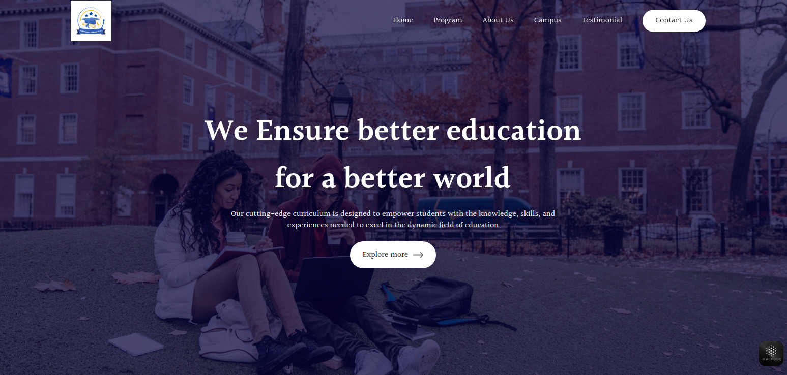

🌍 Internazionale Lisa Academy
A modern, global educational platform built with React & Web3Forms

🖥️ Project Preview

The homepage features a beautiful university-style background with two students studying, giving a scholarly and welcoming first impression.

Top-right navigation bar includes:

Home

Program

About Us

Campus

Testimonial

Contact Us (Stylishly highlighted with a button)

The hero section includes:

“We Ensure better education for a better world”
Alongside a call to action: "Explore more →"

💡 Project Description
Internazionale Lisa Academy is a responsive academic website built using React, with seamless email integration powered by Web3Forms.

This landing page aims to promote an international school that prioritizes global learning, accessibility, and cutting-edge digital communication.

✨ Key Features:
✅ Responsive Design: Fully optimized for desktop and mobile.

📬 Contact Integration: Built with Web3Forms to collect contact messages without a backend.

🌐 Elegant UI: Clean typography and layout for a premium academic look.

⚛️ Powered by React: Fast, component-based architecture for scalability.

📎 Easy Navigation: Clear links to programs, testimonials, campus info, and more.

🧰 Tech Stack
Frontend: React + CSS (or Tailwind if used)

Email Handling: Web3Forms

